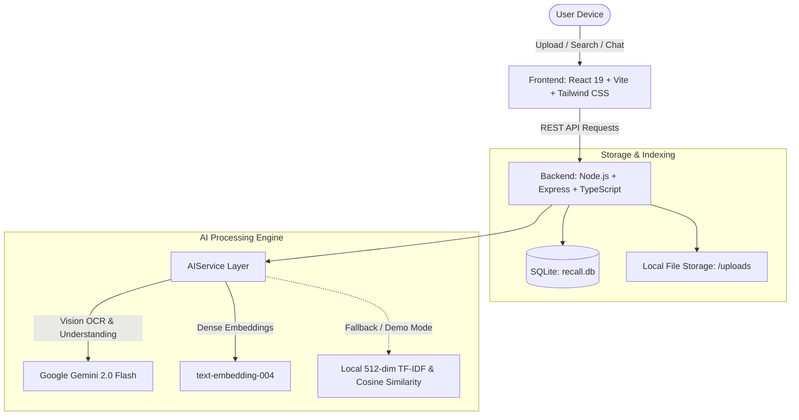

# Recall — AI-Powered Personal Memory & Life Assistant

> **“You remember what you saw. Recall remembers where it is.”**  
> *Your phone remembers what you forget.*

---

## 1. The Problem

Every day, smartphone users take dozens of screenshots, download receipts, save train tickets, capture invoices, and photograph warranty cards. Over time, these critical fragments of life administration get lost in camera rolls with thousands of images and buried inside file downloads. 

When users actually need this information — during a warranty claim, bill payment deadline, airport check-in, or tax filing — they cannot remember exact filenames or where they saved them. Exact keyword search fails because people remember **context, concepts, and intentions**, not OCR filenames.

---

## 2. The Solution: Recall

**Recall** is an AI-powered personal memory assistant designed as an AI-native smartphone experience. It ingests screenshots, receipts, invoices, tickets, warranties, certificates, and medical documents, analyzes them with multimodal AI, extracts entities and important dates, and indexes them into an associative memory graph.

When users ask questions in natural language, Recall:
1. **Understands** what they mean (semantics, not just keywords).
2. **Finds** the exact document or screenshot.
3. **Connects** related memories (e.g. laptop invoice ↔ warranty card ↔ laptop stand receipt).
4. **Notices** upcoming expiration dates and deadlines.
5. **Reminds** the user before they forget.

---

## 3. Key MVP Features

- **Natural Language Memory Search**: Semantic search that answers questions like *"Find the restaurant my friend recommended in Hyderabad"*, *"When does my laptop warranty expire?"*, and *"Where is my Chennai train ticket?"*.
- **Multimodal AI Understanding**: Automatically extracts titles, categories, dates, amounts, locations, phone numbers, entities, and summaries from images and PDFs.
- **Contextual Memory Connections**: Automatically clusters related items (e.g. a complete electronics purchase package or a travel trip) with confidence scores and relationship types.
- **Smart Reminders & Life Admin**: Detects critical dates from warranties, tickets, and bills, suggesting timely reminders.
- **Interactive AI Memory Assistant**: Ask conversational questions directly to your private memory vault.
- **Instant Demo Mode**: Pre-loaded with 15 realistic Indian-context demo memories, working offline without requiring an API key.
- **Mobile-First Responsive Interface**: Designed like a native smartphone app with bottom navigation and quick actions, while scaling seamlessly to desktop.
- **Privacy-First Design**: Clear privacy toggles and explicit local/on-device architecture roadmap.

---

## 4. Architecture Overview



---

## 5. The AI Pipeline

```text
USER UPLOADS FILE (PNG, JPG, PDF)
                ↓
           PRE-PROCESSING
  (Sharp Thumbnailing / PDF Text Extract)
                ↓
       MULTIMODAL AI ANALYSIS
 (Gemini 2.0 Flash / Vision Document Parser)
                ↓
    STRUCTURED ENTITY EXTRACTION
(Merchant, Product, Amount, Dates, Locations)
                ↓
        VECTOR EMBEDDING
 (Gemini Embeddings or Local 512-D TF-IDF Vector)
                ↓
   CONTEXTUAL RELATIONSHIP MAPPING
    (Same Product, Same Trip, Related)
                ↓
      SMART REMINDER DETECTION
      (Warranty, Due Dates, Travel)
```

---

## 6. Tech Stack

- **Frontend**:
  - React 19 + TypeScript
  - Vite + Tailwind CSS v4
  - Radix UI & shadcn/ui components
  - Lucide React icons
  - Framer Motion animations
  - TanStack Query v5 + Zustand state management
  - React Router v7
- **Backend**:
  - Node.js + Express + TypeScript
  - SQLite via `better-sqlite3` (Zero external setup required)
  - Google Gemini API (`@google/generative-ai`)
  - `sharp` for image thumbnailing & resizing
  - `pdf-parse` for document extraction
  - `multer` for secure multipart upload handling

---

## 7. Privacy Architecture

Recall is designed around the core belief: **Your memories belong to you.**

- **Demo MVP Architecture**: In the demo version, uploaded memories are processed through backend API routes and stored in a private local SQLite database.
- **On-Device Vision Roadmap**: In a native mobile application, OCR and embeddings can execute directly on-device using mobile hardware acceleration (e.g. Apple Neural Engine / Qualcomm NPU / Android AICore) to ensure that sensitive screenshots and personal documents never leave the smartphone.
- **Zero Third-Party Tracking**: No analytics, trackers, or data-sharing SDKs.

---

## 8. Local Setup & Quickstart

### Prerequisites
- Node.js (v18 or higher, v20+ recommended)
- npm

### 1. Clone & Install
```bash
# Clone the repository
git clone <repo-url>
cd recall

# Install backend dependencies
cd backend
npm install

# Install frontend dependencies
cd ../frontend
npm install
```

### 2. Environment Configuration
Create a `.env` file in `backend/`:
```env
PORT=3001
NODE_ENV=development
DEMO_MODE=true

# Optional: Add your Google Gemini API key for live multimodal processing
# GEMINI_API_KEY=your_gemini_api_key_here
```

*(Note: If `GEMINI_API_KEY` is not provided, Recall automatically uses its built-in TF-IDF semantic engine and 15 pre-computed demo memories so judges can test every feature immediately).*

### 3. Run the Application
In separate terminals:

```bash
# Terminal 1: Start Backend (Port 3001)
cd backend
npm run dev

# Terminal 2: Start Frontend (Port 5173)
cd frontend
npm run dev
```

Open your browser and navigate to:
```
http://localhost:5173
```

---

## 9. Hackathon Judge Demonstration Scenarios

The MVP includes 15 realistic Indian-context demo memories. Test these critical scenarios directly:

1. **Scenario 1 — Screenshot Search**:
   - Query: `Find the restaurant my friend recommended in Hyderabad`
   - *Result*: Instantly retrieves the ABC Rooftop Restaurant screenshot with location, contact info, and match reasons.
2. **Scenario 2 — Warranty Lookup**:
   - Query: `When does my laptop warranty expire?`
   - *Result*: Retrieves the Lenovo Laptop Warranty Card and displays expiry date (Sep 12, 2027).
3. **Scenario 3 — Contextual Connections**:
   - Query: `Show everything related to my laptop`
   - *Result*: Returns Laptop Invoice, Warranty Card, and Amazon Laptop Stand order. Open any card to view the Contextual Connections graph.
4. **Scenario 4 — Travel Retrieval**:
   - Query: `Where is my Chennai train ticket?`
   - *Result*: Retrieves Rajdhani Express ticket with seat B4-32, PNR, and linked Taj Club House hotel booking.
5. **Scenario 5 — Spending Calculations & Expenses**:
   - Query: `How much did I spend on electronics this year?`
   - *Result*: Returns all electronics purchase invoices with prices and merchants.
6. **Scenario 6 — Smart Reminders**:
   - Navigate to the **Reminders** tab:
   - View pending reminders automatically flagged by AI (Electricity Bill due in 3 days, Train journey, Follow-up, Warranty).
   - Mark as completed or dismiss with one click.
